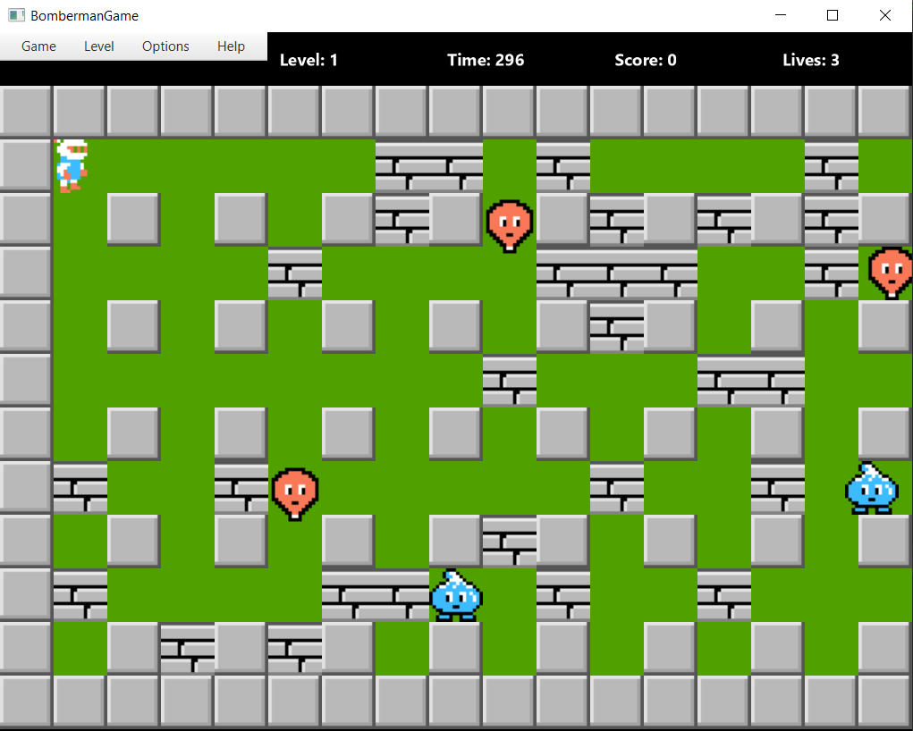
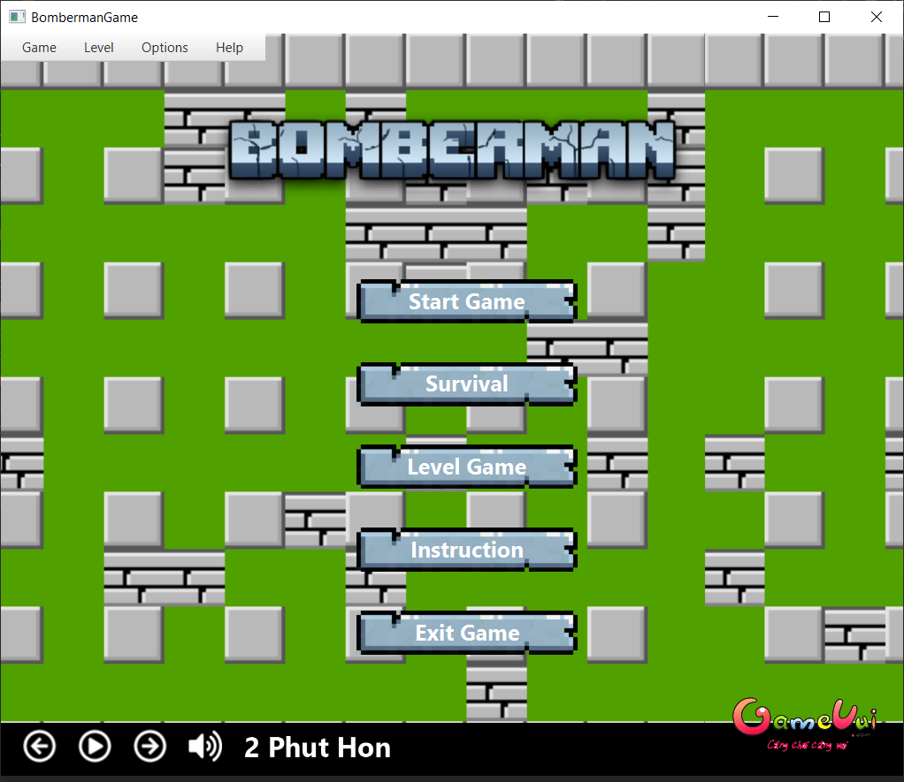
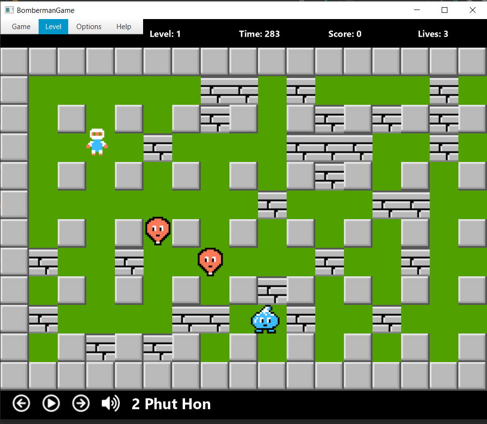
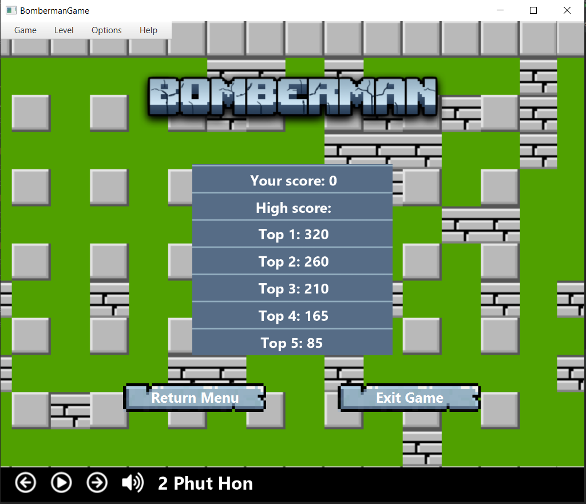

# Bài tập lớn OOP - Bomberman Game
## **Nhóm 44.**

## **Mục lục**
1. [Thành viên](https://github.com/huudong03uet/BombermanGame#1-th%C3%A0nh-vi%C3%AAn)
1. [Giới thiệu](https://github.com/huudong03uet/BombermanGame#2-gi%E1%BB%9Bi-thi%E1%BB%87u)
3. [Mô tả về các đối tượng trong trò chơi](https://github.com/huudong03uet/BombermanGame#3-m%C3%B4-t%E1%BA%A3-v%E1%BB%81-c%C3%A1c-%C4%91%E1%BB%91i-t%C6%B0%E1%BB%A3ng-trong-tr%C3%B2-ch%C6%A1i)
4. [Controls and Options](https://github.com/huudong03uet/BombermanGame#4-controls-and-options)
5. [Chức năng đã làm theo yêu cầu](https://github.com/huudong03uet/BombermanGame#5-ch%E1%BB%A9c-n%C4%83ng-%C4%91%C3%A3-l%C3%A0m-theo-y%C3%AAu-c%E1%BA%A7u)
6. [Chức năng làm thêm](https://github.com/huudong03uet/BombermanGame#6-ch%E1%BB%A9c-n%C4%83ng-l%C3%A0m-th%C3%AAm)
7. [Thư viện, IDE sử dụng](https://github.com/huudong03uet/BombermanGame#7-th%C6%B0-vi%E1%BB%87n-ide-s%E1%BB%AD-d%E1%BB%A5ng)
8. [UML Diagram](https://github.com/huudong03uet/BombermanGame#8-uml-diagram)
9. [Demo](https://github.com/huudong03uet/BombermanGame#9-demo)

## **1. Thành viên** 
### **Họ và tên: Nguyễn Hữu Đồng**
*MSV 21020760*
### **Họ và tên: Lê Minh Châu**
*MSV 21020286*

## **2. Giới thiệu**
Trong bài tập lớn này là viết một phiên bản Java mô phỏng lại trò chơi [Bomberman](https://www.youtube.com/watch?v=mKIOVwqgSXM) kinh điển của NES.

<!--suppress CheckImageSize -->

## **3. Mô tả về các đối tượng trong trò chơi**
Nếu bạn đã từng chơi Bomberman, bạn sẽ cảm thấy quen thuộc với những đối tượng này. Chúng được được chia làm hai loại chính là nhóm đối tượng động (*Bomber*, *Enemy*, *Bomb*) và nhóm đối tượng tĩnh (*Grass*,  *Wall*, *Brick*, *Door*, *Item*).

*Hãy thiết kế hệ thống các đối tượng một cách phù hợp để tận dụng tối đa sức mạnh của OOP: tái sử dụng code, dễ dàng maintain.*

-  *Bomber* là nhân vật chính của trò chơi. Bomber có thể di chuyển theo 4 hướng trái/phải/lên/xuống theo sự điều khiển của người chơi. 

-  *Enemy* là các đối tượng mà Bomber phải tiêu diệt hết để có thể qua Level. Enemy có thể di chuyển ngẫu nhiên hoặc tự đuổi theo Bomber tùy theo loại Enemy. Các loại Enemy sẽ được mô tả cụ thể ở phần dưới.

-  *Bomb* là đối tượng mà Bomber sẽ đặt tại các ô Grass. Khi đã được kích hoạt, Bomber và Enemy không thể di chuyển vào vị trí Bomb. Tuy nhiên ngay khi Bomber vừa đặt và kích hoạt Bomb tại ví trí của mình, Bomber có một lần được đi từ vị trí đặt Bomb ra vị trí bên cạnh. Sau khi kích hoạt 1.5s, Bomb sẽ tự nổ, các đối tượng *Flame*  được tạo ra.

-  *Grass* là đối tượng mà Bomber và Enemy có thể di chuyển xuyên qua, và cho phép đặt Bomb lên vị trí của nó

-  *Wall* là đối tượng cố định, không thể phá hủy bằng Bomb cũng như không thể đặt Bomb lên được, Bomber và Enemy không thể di chuyển vào đối tượng này

-  *Brick* là đối tượng được đặt lên các ô Grass, không cho phép đặt Bomb lên nhưng có thể bị phá hủy bởi Bomb được đặt gần đó. Bomber và Enemy thông thường không thể di chuyển vào vị trí Brick khi nó chưa bị phá hủy.

-  *Portal* là đối tượng được giấu phía sau một đối tượng Brick. Khi Brick đó bị phá hủy, Portal sẽ hiện ra và nếu tất cả Enemy đã bị tiêu diệt thì người chơi có thể qua Level khác bằng cách di chuyển vào vị trí của Portal.

Các *Item* cũng được giấu phía sau Brick và chỉ hiện ra khi Brick bị phá hủy. Bomber có thể sử dụng Item bằng cách di chuyển vào vị trí của Item. Thông tin về chức năng của các Item được liệt kê như dưới đây:
-  *SpeedItem* Khi sử dụng Item này, Bomber sẽ được tăng vận tốc di chuyển thêm một giá trị thích hợp.

-  *FlameItem* Item này giúp tăng phạm vi ảnh hưởng của Bomb khi nổ (độ dài các Flame lớn hơn)

-  *BombItem* Thông thường, nếu không có đối tượng Bomb nào đang trong trạng thái kích hoạt, Bomber sẽ được đặt và kích hoạt duy nhất một đối tượng Bomb. Item này giúp tăng số lượng Bomb có thể đặt thêm một.
-  *FlamepassItem* Item này cho phép Bomber tăng thêm sức mạnh của flames. Nếu kết hợp với FlameItem có thể phá huỷ được 2 Brick liên tiếp hoặc giết Enemy đứng sau Brick.

-  *WallpassItem* Item này cho phép Bomber đi qua các đối tượng Wall mà không bị chặn lại trong thời gian cho phép (10 giây).
-  *DetonatorItem* Item này cho phép Bomber bất tử trong thời gian cho phép (10 giây).

Có nhiều loại Enemy trong Bomberman, tuy nhiên trong phiên bản này chỉ cài đặt 6 loại enemy sau:

-  *Balloom* là Enemy đơn giản nhất, di chuyển ngẫu nhiên với vận tốc cố định

-  *Oneal* có di chuyển ngẫu nhiên với tốc độ nhanh hơn Balloom.

-  *Doll* là Enemy di chuyển "thông minh" hơn so với Balloom (biết đuổi theo Bomber).

-  *Minvo* có di chuyển "thông minh" như Doll, với tốc độ của Oneal.
-  *Pass* có di chuyển đơn giản như Balloom, tuy nhiên nếu 1 màn chơi có sự xuất hiện của Pass, Pass sẽ xuất hiện từ vụ nổ của Bomb được Bomber đặt. Pass có thể có tối đa đến 0 đến 5 con (tuỳ độ khó của màn chơi).

-  *Ghost* là Enemy di chuyển "thông minh" như Doll, tuy nhiên nếu Ghost ra ngoài phạm vi của Bomber, Ghost có thể tàng hình trong những khoảng thời gian. Trong thời gian tàng hình, Ghost có đầy đủ tính chất như 1 Enemy thông thường (có thể giết Bomber và có thể bị giết bởi bomb).

-  *Kondoria* là Enemy có khả năng đặc biệt là có thể đi xuyên tường, đi với tốc độ nhanh để đuổi theo bạn 1 cách tối ưu nhất có thể. Khi Kondoria tiến gần đến bạn, Kondoria sẽ tăng tốc. Bạn chỉ có thể giết được Kondoria nếu hơn 1 nửa thân của chúng không được Brick bảo vệ.

## Mô tả game play, xử lý va chạm và xử lý bom nổ
- Trong một màn chơi, Bomber sẽ được người chơi di chuyển, đặt và kích hoạt Bomb với mục tiêu chính là tiêu diệt tất cả Enemy và tìm ra vị trí Portal để có thể qua màn mới

- Bomber sẽ bị giết khi va chạm với Enemy hoặc thuộc phạm vi Bomb nổ. Lúc đấy trò chơi kết thúc.

- Enemy bị tiêu diệt khi thuộc phạm vi Bomb nổ

- Một đối tượng thuộc phạm vi Bomb nổ có nghĩa là đối tượng đó va chạm với một trong các tia lửa được tạo ra tại thời điểm một đối tượng Bomb nổ.

- Khi Bomb nổ, một Flame trung tâm tại vị trí Bomb nổ và bốn Flame tại bốn vị trí ô đơn vị xung quanh vị trí của Bomb xuất hiện theo bốn hướng trên/dưới/trái/phải. Độ dài bốn Flame xung quanh mặc định là 1 đơn vị, được tăng lên khi Bomber sử dụng các FlameItem.

- Khi các Flame xuất hiện, nếu có một đối tượng thuộc loại Brick/Wall nằm trên vị trí một trong các Flame thì độ dài Flame đó sẽ được giảm đi để sao cho Flame chỉ xuất hiện đến vị trí đối tượng Brick/Wall theo hướng xuất hiện. Lúc đó chỉ có đối tượng Brick/Wall bị ảnh hưởng bởi Flame, các đối tượng tiếp theo không bị ảnh hưởng. Còn nếu vật cản Flame là một đối tượng Bomb khác thì đối tượng Bomb đó cũng sẽ nổ ngay lập tức.

## **4. Controls and Options**

| Control | Key 1 |
|---------|-------|
| UP      | ↑     | 
| DOWN    |  ↓    | 
| LEFT    |  ←    |
| RIGHT   |  →    | 
| BOMB    | SPACE | 

| Option       | Key                 |
|--------------|---------------------|
| New Game     | Ctrl + N            |
| Restart      | Ctrl + O            |
| Pause        | Ctrl + P            |
| Resume       | Ctrl + P            |
| Exit         | Ctrl + W / Alt + F4 |
| Change level | Shift + level       |

## **5. Chức năng đã làm theo yêu cầu**
1. Thiết kế cây thừa kế cho các đối tượng game
2. Xây dựng bản đồ màn chơi từ tệp cấu hình.
3. Di chuyển Bomber theo sự điều khiển từ người chơi.
4. Tự động di chuyển các Enemy.
5. Xử lý va chạm cho các đối tượng Bomber, Enemy, Wall, Brick, Bomb.
6. Xử lý bom nổ.
7. Xử lý khi Bomber sử dụng các Item và khi đi vào vị trí Portal.

8. Nâng cấp thuật toán tìm đường cho Enemy.
9. Cài đặt thêm các loại Enemy khác.
10. Xử lý hiệu ứng âm thanh (thêm music & sound effects).

## **6. Chức năng làm thêm**
1. Xây dựng 2 chế độ chơi game: qua màn và sinh tồn.

2. Xây dựng nhiều level cho game, mỗi level có các enemy khác nhau.

2. Xây dựng thanh MenuBar cho game.

3. Xây dựng danh sách nhạc để có thể thay đổi tuỳ thích.

4. Phát triển chương trình để có thể chơi qua mạng LAN (đang xây dựng).

5. Làm menu bắt đầu chơi game, menu khi kết thúc game.

7. Cài đặt thêm nhiều loại Item khác.

6. Lưu lại điểm số cao nhất (bằng cách sử dụng đọc ghi file).

## **7. Thư viện, IDE sử dụng**

- IntelliJ IDEA Community Edition 2022.1.3
- JavaFx
- Maven Framework

## **8. UML Diagram**

## **9. Demo**

